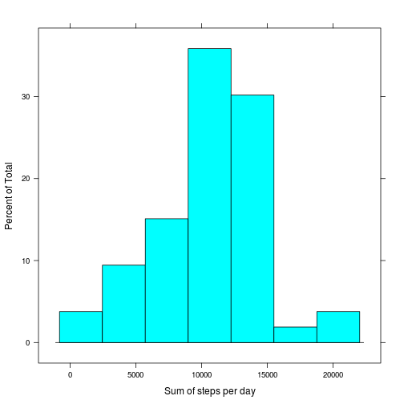
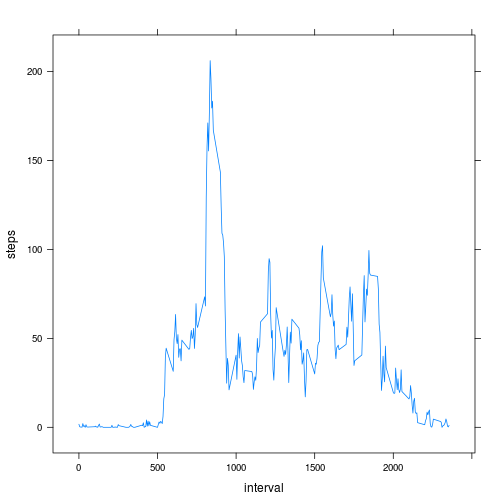
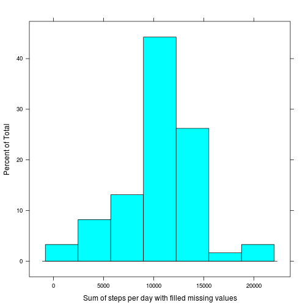
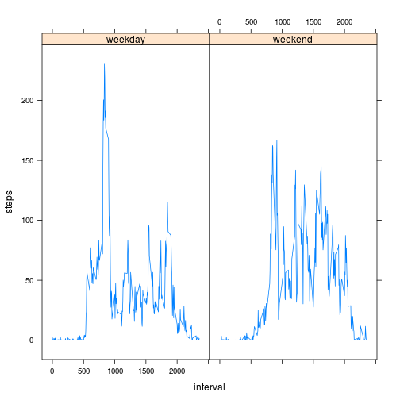

Loading and preprocessing the data

```r
## unzip ("activity.zip", exdir = "./")
mydata<-read.csv("activity.csv",header=TRUE)
library(plyr)
library(lattice)
library(lubridate)
mydata$date<-ymd(mydata$date)
```


What is mean total number of steps taken per day?

```r
histogram(aggregate(steps ~ date, mydata, sum)$steps,xlab="Sum of steps per day")
```

 

```r
mean(aggregate(steps ~ date, mydata, sum)$steps)
```

```
## [1] 10766.19
```

```r
median(aggregate(steps ~ date, mydata, sum)$steps)
```

```
## [1] 10765
```


What is the average daily activity pattern?

```r
pattern<-aggregate(steps ~ interval, mydata, mean)

xyplot(steps~interval, data = pattern, type="l")
```

 

```r
#plot(pattern$steps,type="l")
```

The maximum (averaged) number of steps in all time intervals is 

```r
m<-max(pattern$steps)
```


It occured in the interval

```r
mint<-which(pattern$steps==m)

print(mint)
```

```
## [1] 104
```

```r
print(mint*5/60)
```

```
## [1] 8.666667
```

```r
seconds_to_period(mint*5*60)##???
```

```
## [1] "8H 40M 0S"
```

```r
seconds_to_period((mint+1)*5*60)##???
```

```
## [1] "8H 45M 0S"
```


Imputing missing values. In the original data there is a considerable number of missing values, namely

```r
sum(is.na(mydata$steps))
```

```
## [1] 2304
```


We have taken the following approach to filling the missing values: take the average of all available data for that interval and assign this number to all corresponding intervals with missing data.

```r
impute <- function(df,pattern,intv) {

newsteps<-df[df$interval==intv,]$steps;

newvalue<-pattern[pattern$interval==intv,]$steps;

newsteps[is.na(newsteps)]<-newvalue;

newsteps;}


myimputeddata<-ddply(mydata, .(interval), transform, steps=impute(mydata,pattern,interval[1]))


histogram(aggregate(steps ~ date, myimputeddata, sum)$steps,
          xlab="Sum of steps per day with filled missing values")
```

 


The newly calculated mean with missing values thus filled does not differ from the old mean, which is exactly what we would expect:

```r
mean(aggregate(steps ~ date, myimputeddata, sum)$steps)
```

```
## [1] 10766.19
```

The newly calculated median with missing values thus filled differs very slightly, it is a little bit bigger than the old meadian. This is also not strange.

```r
median(aggregate(steps ~ date, myimputeddata, sum)$steps)
```

```
## [1] 10766.19
```


Are there differences in activity patterns between weekdays and weekends?

```r
computedaytype <- function(date) {

v<-wday(date);

v[v %in% c(1, 7)]<-"weekend";

v[v %in% c(2:6)]<-"weekday";

v;}

myimputeddata<-transform(myimputeddata, daytype=computedaytype(myimputeddata$date))

pattern2<-aggregate(steps ~ interval+daytype, myimputeddata, mean)

xyplot(steps~interval | daytype, data = pattern2, type="l")
```

 

As we can see from the figure, the pattern on weekends has less of a structure, than the pattern on weekdays, where peaks are more pronounced.
