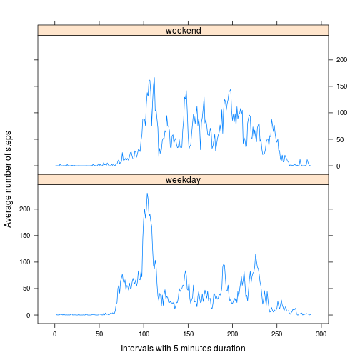

# Analysing activity patterns

### Loading and preprocessing the data


```r
mydata<-read.csv("activity.csv",header=TRUE)
library(plyr)
library(lattice)
library(lubridate)
mydata$date<-ymd(mydata$date)
```

### Statistics for average number of steps per day 

Distribution of the total number of steps taken per day

```r
histogram(aggregate(steps ~ date, mydata, sum)$steps,xlab="Sum of steps per day")
```

 

Mean number of steps taken per day:


```r
mean(aggregate(steps ~ date, mydata, sum)$steps)
```

```
## [1] 10766.19
```

Median of the number of steps taken per day: 


```r
median(aggregate(steps ~ date, mydata, sum)$steps)
```

```
## [1] 10765
```


### Average daily activity pattern


```r
pattern<-aggregate(steps ~ interval, mydata, mean)

xyplot(steps~seq_along(steps), data = pattern, type="l", 
       xlab="Intervals with 5 minutes duration",
       ylab="Average number of steps")
```

 

The maximum (averaged) number of steps in all time intervals is 

```r
m<-max(pattern$steps);
  
m  
```

```
## [1] 206.1698
```


It occured in the 5 minutes interval between

```r
mint<-which(pattern$steps==m)

seconds_to_period(mint*5*60)
```

```
## [1] "8H 40M 0S"
```

and 


```r
seconds_to_period((mint+1)*5*60)
```

```
## [1] "8H 45M 0S"
```


### Imputing missing values

In the original data there is a considerable number of missing values, namely


```r
sum(is.na(mydata$steps))
```

```
## [1] 2304
```


We have taken the following approach to filling the missing values: take the average of all available data for that interval and assign this number to all corresponding intervals with missing data.


```r
impute <- function(df,pattern,intv) {

newsteps<-df[df$interval==intv,]$steps;

newvalue<-pattern[pattern$interval==intv,]$steps;

newsteps[is.na(newsteps)]<-newvalue;

newsteps;}


myimputeddata<-ddply(mydata, .(interval), transform, steps=impute(mydata,pattern,interval[1]))


histogram(aggregate(steps ~ date, myimputeddata, sum)$steps,
          xlab="Sum of steps per day with filled missing values")
```

 


The newly calculated mean with missing values filled in this way does not differ from the old mean, which is exactly what we would expect:


```r
mean(aggregate(steps ~ date, myimputeddata, sum)$steps)
```

```
## [1] 10766.19
```

The newly calculated median with missing values filled in this way differs very slightly from the old median (it is in fact equal to the mean). It is a little bit bigger than the old median, which is not surprising:


```r
median(aggregate(steps ~ date, myimputeddata, sum)$steps)
```

```
## [1] 10766.19
```


### Differences in activity patterns between weekdays and weekends


```r
computedaytype <- function(date) {

v<-wday(date);

v[v %in% c(1, 7)]<-"weekend";

v[v %in% c(2:6)]<-"weekday";

v;}

myimputeddata<-transform(myimputeddata, daytype=computedaytype(myimputeddata$date))

pattern2<-aggregate(steps ~ interval+daytype, myimputeddata, mean)

pattern2<-transform(pattern2,ninterval=c(1:288,1:288))

xyplot(steps~ninterval | daytype, data = pattern2, type="l", layout=c(1,2),
       xlab="Intervals with 5 minutes duration",
       ylab="Average number of steps")
```

 

As we can see from the figure, the pattern on weekends has less of a structure, than the pattern on weekdays, where peaks are more pronounced.
